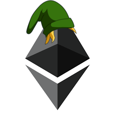

# Welcome to The Legend of Ether

> It's dangerous to go centralized! Take this.

> 

The Legend of Ether is a Proof of Concept showcasing how a massively online multiplayer game could be developed **today** where users trully own their items, their accounts, and is actually fun to play.

## Problem

Current decentralized games that run on Ethereum only allow the user to make a couple of choices. They then play themselves, the "player" merely watching. That is no fun!

For a game to be actually playable, the first and most important thing is for players to be able to walk around. To see other players walking around. To interact with the environment, with objects and with other players.

## Challenge

The problem that arises when introducing the ability to walk and interact with objects that are positioned in the space is that someone has to make sure the user is actually standing in front of the item they're trying to interact with.

This is traditionally solved by storing the position of users in a server and having clients send information about what the players are doing rather than sending status updates. In simple English: clients send "start walking forward" or "walk one step forward" commands, rather than "my position is now X, Y".

If we wanted to do this 100% on-chain, that would mean roughly creating and broadcasting two transactions per key-press per user. Games like PUBG have had [over 3 million players concurrently](http://steamcharts.com/app/578080). Crypto Kitties brought Ethereum down to its knees with [orders of magnitude less than that](http://dappboard.com/app/application/5a5849635d7064dc7fb37cd0).

Solutions like side chains and state channels are being actively researched and developed, but we may be years away from being able to handle traffic like that.

## Solution

The Legend of Ether chooses to follow a hybrid approach: [The Legend of Ether API](https://github.com/legend-of-ether/api) is the `onlyOwner` in [The Legend of Ether Contract](https://github.com/legend-of-ether/sol), coordinating live connections among clients using Socket.IO, verifying clients aren't trying to cheat by storing their positions in the world and calling functions in the contract to give players items.

Players sign in to LoE using MetaMask. Their LoE account is their Ethereum Address, and they own anything they find, capture or loot in the game. 

In the extreme case LoE was wiped out of the planet, player's accounts, items and money would survive. Even more, if the LoE team started abusing its powers, given that the project is 100% open source and provided under the MIT license, anyone could fork both the code base and contract, give it a different name and air-drop all of the LoE users. The possibility (and ease) of this happening is **incentive to be a good actor**.

## Breakthrough

LoE's technology is simple but its goal is ambitious: to shake companies like Blizzard or Microsoft by imposing a new standard in the market. 

Many projects attempt to boil the ocean but wind up delivering one-time experiments. LoE is a project that could be implemented and compete with AAA games **today**.

If decentralized games become actually playable, players will start playing them. And if players start playing them, companies will notice. They will start exploring that area too, and the market will be forever changed. From that day forward, all games will have elements of decentralization, players actually owning their accounts.

## Landscape

> The most merciful thing in the world, I think, is the inability of the human mind to correlate all its contents. We live on a placid island of ignorance in the midst of black seas of infinity, and it was not meant that we should voyage far. The sciences, each straining in its own direction, have hitherto harmed us little; but some day the piecing together of dissociated knowledge will open up such terrifying vistas of reality, and of our frightful position therein, that we shall either go mad from the revelation or flee from the deadly light into the peace and safety of a new dark age.

This is the opening of The Call of Cthulhu by H. P. Lovecraft. But, unlike in the classic horror masterpiece, the association of knowledge that has been accumulated in different areas wil not bring darkness but light.

Different projects have been pushing the bar in different directions: [decentralized virtual land](https://decentraland.org/), [decentralized virtual money](https://gamecredits.com/), [decentralized virtual pets](https://www.cryptokitties.co/) and more, each focusing on its own niche. 

It's time to bring them all together under one flag, placing ownership in the hands of users.

 
